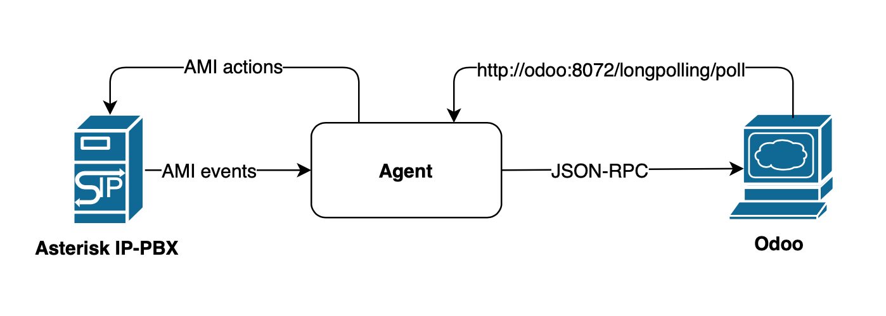

===============================================
 Asterisk Calls Odoo Application documentation
===============================================

.. contents::
   :depth: 4

Installation
------------
To get this working You need:

* **Install Odoo modules** and do some Odoo users <-> Asterisk extensions configuration.
* **Do some Asterisk configuration** - add getting caller name from Odoo and more.
* **Run Odoo Asterisk agent** - a script that connects to Asterisk Manager
  Interface (AMI) and listens for events / sends actions. Agent can be run
  from any place: Odoo server, Asterisk server or just a docker service.

Here is the architecture of the solution:

Docker compose deploy
#####################
There is a deploy folder in the application package that contains docker-compose style installation.
The deploy folder contains 3 directories:

- **agent** (a middleware between Odoo and Asterisk, you already have 
  Odoo and Asterisk you may want to run only a docker based Agent installation).
- **odoo** (installation of Odoo and PostgreSQL, if you already have  
  Asterisk running then you may want to run docker based Odoo and Agent.
- **asterisk** (If you want a complete all-in-one suite run all components).

To customize your installation use ``docker-compose.override.yml`` to set your custom values.

Odoo
####
Do a database backup before installation (just in case :-P).

**This app depends on** `remote_agent <https://www.odoo.com/apps/modules/12.0/remote_agent/>`_ 
**addon so your should download it and install first (see installation notes there).**

Please note that *remote_agent* depends on external python libraries *tinyrpc* and *humanize*.
Installation of these dependencies is covered in *remote_agent* documentation.

Odoo configuration
++++++++++++
Be sure to **enable Odoo long polling** feature and make sure long polling port is available for Odoo users.

**Be sure to use it as a base service for WEB requests!** If You see in your Odoo logs `this <https://pastebin.com/MZBLqxXG>`_ message it means your users try
to use click to call feature using a process worker (8069) not a gevent one (8072).
So either let users open http://your-odoo:8072 or configure nginx to proxy all *backend* requests to port 8072.

To activate long polling and have enougth workers for this app start Odoo with at least --workers=4 or set it in odoo.conf:

.. code-block::

 [options]
 workers = 4
 longpolling_port = 8072

*Attention! This is just an example of conf file options that must be set! Don't throw away
your own options!!!*

Be sure to have the following record in your Odoo startup logs:

.. code-block::

 astcall_odoo | 2018-09-10 15:37:58,920 18 INFO ? odoo.service.server: Evented Service (longpolling) running on 0.0.0.0:8072

Asterisk agent account
++++++++++++++++++++++
When *asterisk_calls* module is installed it creates a separate Odoo account for Asterisk Agent.
This account does not belong to users group and is listed when Internal Users filter is removed.

Also this makes possible to save a license on Odoo Enterprise version.

Change account password
+++++++++++++++++++++++
**Not required but strictly recommended!** By default *Agent* is configured 
to use *asterisk_service* Odoo account.

It's advised to change its password in Odoo and also ODOO_PASSWORD environment variables for *Agent* (see below).

Set account time zone
+++++++++++++++++++++
Asterisk sends call records in its server's time zone. You should set 
*asterisk_service* account time zone in user's preferences to value set in Asterisk server.

To see time zone settings for account you should activate Odoo developer mode.

Configure users and groups
++++++++++++++++++++++++++
Map Odoo users with Asterisk user's extensions.

Users who use Asterisk Calls must have *Asterisk Calls User* permission.

For SIP users you can specify SIP alert-info header to enable auto answer feature.
Check you SIP phone manuals for that.

After you mapped Odoo users with Asterisk extensions users can use click to call feature.

When you map Odoo user to Asterisk extensions in *Asterisk Calls -> Users menu* 
user is automatically added to *Asterisk Calls* group.

When you delete Asterisk user mapping Asterisk call permission is automatically removed from Odoo user.

Website callback form issue
+++++++++++++++++++++++++++
*Odoo 10.0 attention!* Be sure that your web site is served by worker on port 8069 and not 
by gevent port 8072! There is a bug in Python 2.7.9 and **gevent** regarding SSL module 
so ReCaptcha will not work if form is loaded from **gevent** worker. This is a known limitation that is 
solved in Odoo 11 and I still think about workaround (send me your idea if you have one!).

If you get in your log the following error message

.. code::

 __init__() got an unexpected keyword argument 'server_hostname'

that means your web server is served by gevent worker (port 8072). Reconfigure 
your proxy server to pass requests to process worker (port 8069).

Asterisk
########
You need is to allow *Agent* to connect to your Asterisk server AMI port (usually 5038).
This app *does not use* asterisk database connection to Odoo.

You need to cut leading + on numbers incoming from trunks before passing it to get_caller_name.

Here are the examples of required configuration options.

**cdr.conf**:

.. code::

  [general]
  enable=yes
  unanswered = yes
  congestion = yes  

**cdr_manager.conf**:

.. code::

  [general]
  enabled = yes

  [mappings]
  start => started
  answer => answered
  end => ended
  linkedid => linkedid
  sequence => sequence

**manager.conf**:

.. code::

  [general]
  enabled = yes
  webenabled = no ; Asterisk calls does not use HTTP interface
  port = 5038 ; You can put any port here but adjust MANAGER_PORT variable for Agent.
  bindaddr = 0.0.0.0 # You can put your IP here and set ASTERISK_HOST variable for Agent.

  [odoo] ; Adjust also MANAGER_LOGIN for Agent
  secret=odoo ; Adjust also MANAGER_PASSWORD for Agent
  displayconnects = yes
  read=call,dialplan,cdr,user
  write=system,call,originate
  deny=0.0.0.0/0.0.0.0
  permit=127.0.0.1/255.255.255.0

**Important!** For security reasons always use deny/permit options in your manager.conf. 
Change permit option to IP address of your Asterisk server if agent is not started on the same box.

Dialplan configuration
++++++++++++++++++++++
Call recording
**************
To enable call recording call *MixMonitor(${UNIQUEID}.wav)*

Set Caller ID name on channel
*****************************

Here you have 2 options:

* Set caller name by Agent. 
* Fetch caller name from Odoo using Asterisk CURL function. 

This is controlled by *Asterisk Calls -> Settings -> Set caller name type*.

If Agent sets caller name on calling channel you need to make a pause in call handling
dialplan to give Agent a reasonable time to fetch caller name from Odoo and set it in the channel.

Here is the example dialplan to summarize the above:

.. code::

   ; Call from DID numbers e.g. PSTN numbers connected to Asterisk box.
  [test-incoming]
  exten => _X.,1,Set(CURLOPT(conntimeout)=3)
  exten => _X.,n,Set(CURLOPT(dnstimeout)=3)
  exten => _X.,n,Set(CURLOPT(httptimeout)=3)
  exten => _X.,n,Set(CURLOPT(ssl_verifypeer)=0)
  ; Record call
  exten => _X.,n,MixMonitor(${UNIQUEID}.wav)  
  ; Get caller ID name from Odoo, adjust db to your Odoo database or remove it if only single db is used.
  exten => _X.,n,Set(CALLERID(name)=${CURL(http://odoo:8072/asterisk_calls/get_caller_name?db=astcalls&number=${CALLERID(number)})})
  
  ; Get partner's manager channel if set.
  exten => _X.,n,Set(manager_channel=${CURL(http://odoo:8072/asterisk_calls/get_partner_manager?db=astcalls&number=${CALLERID(number)})})
  exten => _X.,n,ExecIf($["${manager_channel}" != ""]?Dial(${manager_channel}/${EXTEN},60,t))
  ;
  exten => _X.,n,Answer
  exten => _X.,n,Playback(demo-thanks)
  exten => _X.,n,Queue(sales)

  [post-dial-send-dtmf]
  exten => s,1,NoOp(DTMF digits: ${dtmf_digits})
  same => n,ExecIf($["${dtmf_digits}" = ""]?Return)
  same => n,Wait(${dtmf_delay})
  same => n,SendDTMF(${dtmf_digits})
  same => n,Return

  [test-users]
  exten => _X.,1,MixMonitor(${UNIQUEID}.wav)
  ; Local users pattern
  exten => _XXXX,2,Dial(SIP/${EXTEN},30,TU(post-dial-send-dtmf))
  ; Outgoing calls pattern
  exten => _XXXXX.,2,Dial(SIP/provider/${EXTEN},30,TU(post-dial-send-dtmf))

Askozia setup
+++++++++++++
In ``Calls -> Configuration -> Settings`` set *Originate context* to ``EXTERNALPHONES-internalandexternal``.

FreePBX setup
+++++++++++++
Setup and configuration videos are available `here <https://www.youtube.com/playlist?list=PLjmYA79yb5AR3hkYlLdCdgc36dievvSOm>`_.

Agent
#####
The *Agent* connects to Asterisk Manager Interface (AMI) and listen for events like Newchannel, Cdr,
Hangup, etc. These events are sent to Odoo using *odoorpc* library. 

Agent can be run in any place. But the prefereable one is the same server where Asterisk is installed.
In this case Agent can have access to call recording files and can forward them to Odoo.
This is the only difference from other cases like running Agent on the Odoo server 
or as a docker service (set RECORDING_UPLOAD_ENABLED=0 environment variable to disable call recording uploads).

**Installation steps:**

* **Download** Agent package from Odoo *Asterisk Calls -> Settings -> Download Asterisk Agent* green button.
* **Copy** it to your Asterisk server.
* **Install** requirements from requirements.txt
* **Edit** start_agent.sh and adjust configuration variables.
* **Run** start_agent.sh

To install the required libraries:

.. code:: bash

 cd /agent/
 pip install -r requirements.txt

Now you can start_agent.sh:

.. code:: bash

    bash-4.4# DEBUG=1 ./agent.py
    2018-09-11 19:35:04,883 - DEBUG - __main__ - Connecting to 127.0.0.1:5038 with odoo:odoo
    2018-09-11 19:35:04,890 - INFO - __main__ - Connecting to Odoo at odoo:8069
    2018-09-11 19:35:04,893 - DEBUG - __main__ - Notify on start not set
    2018-09-11 19:35:04,926 - INFO - __main__ - Managed connected
    2018-09-11 19:35:06,220 - INFO - __main__ - Connected to Odoo as asterisk_agent
    2018-09-11 19:35:06,221 - DEBUG - __main__ - Starting odoo bus polling at http://odoo:8072/longpolling/poll

To get it up when system starts add this script to the startup scripts of your system.

Set DEBUG=1 to enable debug mode.

Odoo.sh installation
++++++++++++++++++++
The *Agent* uses long polling to receive call originate command from Odoo. 

Odoo.sh does not allow polling from remote script so special *Agent* configuration is required.

Your should set the following configuration variables:

* DISABLE_ODOO_BUS_POLL=1
* AGENT_ADDRESS=agent.hostname (where agent.hostname is the IP address or host reachable from Odoo.sh)
* AGENT_PORT=40000 (this port *Agent* will listen for requests from Odoo.sh)

Settings
########
You should visit *Asterisk Calls -> Settings* and do some configuration.

Call originate settings
+++++++++++++++++++++++ 
* **Originate Context** - this is Asterisk context name (without brackets) where local users extensions can be found.
  Common contexts for local users are *users*, *from-users*, *local-users*, etc. 
  Also outgoing routes should be defined in this context to allow dialing customers.
* **Originate Timeout** - dial timeout when originating a call to user's device (SIP phone).

Calls
+++++
* **Keep days** - every day call history clean up process is run deleting all calls older
  than specified days.
* **Auto Reload Channels** - this option enables automatic live refresh of active calls.

Callback
++++++++
* **Callback Order** - controls who is dialed first: customer phone or asterisk queue.
* **Callback Queue** - if set the queue must have available agents before call is placed
  otherwise call is placed on next call interval.
* **Queue Exten** - Asterisk extension used to dial the queue or anyother Asterisk application.
* **Originate context** - Asterisk context used to search queue extension and outgoing route.
* **Callback Days** - how many days try to dial the customer.
* **Daily attempts** - how many attempts per day are done to dial the customer.
* **Call interval (minutes)** - pause between dialing attempts in minutes.
* **ReCaptcha Enabled** - use Google ReCaptcha v2 service (https://www.google.com/recaptcha/)

Caller ID Name setting
++++++++++++++++++++++
* **Set Caller Name Type** - AMI (Wait) or dialplan (CURL).
  
  * When *AMI (Wait)* is selected caller name is set by
    Agent on NewChannel event. You have to give Agent a reasonable time to fetch caller name from Odoo and
    set it on the channel using Asterisk *Wait()* dialpan command (see asterisk dialplan example above).
  * When *Dialplan (CURL)* is selected Agent does not fetch caller name from Odoo instead you have to use
    Asterisk CURL function to fetch it from dialplan.
  The first option is easier to implement in Asterisk but wastes some milliseconds. Also sometimes when Odoo is busy
  the is a risk of not getting caller name in specified time. So using CURL is more time saving and reliable.

IP Security
+++++++++++
* **Asterisk IP address(es)** - comma separated list of IP addresses of your Asterisk servers or just one ip
  address if you have one server. As Asterisk CURL function cannot authenticate with Odoo
  /asterisk_calls/get_caller_name URL is public. So you should restrict IP address here for better security.
  Also this URL is forbidden when Caller ID Name setting is not *Dialplan (CURL).

Asterisk Agent
++++++++++++++
* **Restart Asterisk Agent** - when you click this button and Agent is alive you will get a notification message
  telling that Agent was restarted. If you click and get nothing you should look at the Agent process.
* **Download Asterisk Agent** - download a .tar archive with files required for Agent installation.
  See #agent section of this manual.

Web callback
############
In order to use web callback You have to install *Website Builder* application.

*Odoo 10 requirement*: be sure to pass Odoo process worker instance (port 8069) to website site visitors.

Web callback form is accessible at http://localhost:8069/contact_call URL (put your hostname).

Callback from IVR menu
######################
In example below callers getting out of the *sales* queue have a choice to press 0 and 
request a WEB callback.

.. code::

 exten => 500,1,Queue(sales,RtC,,,15)
 same => n,Background(ask-for-callback)
 same => n,WaitExten(3)
 same => n,Hangup()
 
 exten => 0,1,Set(foo=${CURL(http://localhost:8072/asterisk_calls/callback?queue=sales&phone=${CALLERID(num)}&exten=500)})
 same => n,Playback(thanks-for-callback-order)
 same => n,Hangup()

You can also specify a callback time so that call will come on work hours. Here is an example of dialplan:

.. code::

 exten => 500,1,Queue(sales,RtC,,,15)
 same => n,Background(ask-for-callback)
 same => n,WaitExten(3)
 same => n,Hangup()
 
 exten => 0,1,Set(foo=${CURL(http://localhost:8072/asterisk_calls/callback?queue=sales&phone=${CALLERID(num)}&exten=500)})
 same => n,Playback(thanks-for-callback-order)
 same => n,Hangup()

Upgrade
-------
Upgrade steps:

* Backup previous version of this module.
* Copy a new version of this module.
* Update *Asterisk Calls* application in Odoo Apps menu.
* Restart Odoo.
* Download a new Agent pack and update agent.py in your asterisk installation.

If something goes wrong during the upgrade process replace module folder with the previous one and 
contact support.

Support
-------
Module price **DOES** cover  support on installation :-)

**Please get in contact if you have any issue on getting it to work.**

If you need more features or found some bugs please send your requests to odooist@gmail.com.

This module requires running Astrerisk instance (docker deploy included for new installations).

Network connection between Asterisk and Odoo instance is requied.
Please refer to `Asterisk documentaion <https://wiki.asterisk.org/wiki/display/AST/Home>`_ for Asterisk configuration.

Asterisk installation and support are not included in price of this module.

If you are a novice in Asterisk/FreePBX and do not know how to complete Asterisk part of
installation you can request paid support to help you setup your PBX.
Please submit a request `here <mailto:mailbox@odooist.com?subject=Asterisk%20Calls%20Support>`_.

Change Log
----------
2.5
###

* Number matching refactoring (click originated calls are not 100% matched).
* Company consolidated calls: Company account now has all calls from its contacts.

Agent needs to be updated also.

2.4
###

* SIPADDHEADER fix (Interuser calls are no more autoconnected).
* update QoS fix when old Asterisk did not sent all required fields.

2.3
###

* Wrong group permission fix.
* Agent prepared for Multi PBX addon.
* Custom call history report bug fix.
* FR and nl_BE translations added.
* Added an option for Agent to disable active call tracking (DISABLE_ACTIVE_CALL_TRACKING=1)
  for working with outdated Asterisk versions.
* Multi company permission fixes.
* Some improvements on outgoing calls partners and users matching.

*If you do not require any of the above features you can ignore this update.*

2.2
###
This release also requires *remote_agent 1.2 version*.

* Implemented own call status notification system.
* Added daily cron function to clean up hang channels.
  By default calls with duration more then 24 hours are considered as hung.
* Fixed missed call notification. Now these messages go into Inbox. Messages are posted under Asterisk Calls account.
* Added hangup button to active calls list. Removed automatic asterisk hangup action on active call unlink() call.
* Calls in *Library* are not deleted by cron archive calls function and stay in *Library* forever.

2.1
###
This release also requires *remote_agent* 1.1 version.

* Asterisk duplicate channel UNIQUEID bug fix.
* Match call patner bug fix.

2.0
####
* **Agent rewrite**. Now Agent is based on *remote_agent* framework.

Special upgrade note
++++++++++++++++++++
As *asterisk_calls* addon now depends on *remote_agent* addon, the 2-nd must be installed first before trying to update
the 1-st. 
In turn *remote_agent* depends on *tinyrpc* python library. So install it with ``pip3 install tinyrpc``  
on your Odoo server before installing *remote_agent* package.
After that copy *remote_agent* to your addons folder, update your apps and install *remote_agent*.
And only after installing *remote_agent* copy new *asterisk_calls* and upgrade it. 

Do not forget to download new Agent package and also install it. Run ``pip install -r requirements.txt`` and restart the agent.

1.10
####
* Now **Agent detects automatically recording file name** by catching VarSet event 
  with MIXMONITOR_FILENAME variable set by MixMonitor app. That also means
  agent can get all call recordings without any dialplan customizations required.
  MONITOR_DIR removed from env settings.
* _get_formatted_number country code fix.
* Agent HTTPS based communication interface added to use instead of Odoo bus in cases where Odoo bus
  is not available for remote connections (odoo.sh).
* Click2call **button color changed**.
* Added click2call to partner's contacts kanban forms (parent accounts).
* **Sentry** feature added to *Agent*. Now if you want you can set SENTRY_ENABLED=1 and activate 
  sending errors automatically to developer's bug tracker.
* **Recording storage** setting added. Now You can specify how to store recordings - in database or in filestore.
* asterisk_calls service account is not added to users group now so it should **save a license** for enterprise users.

1.0.9
#####
* Asterisk manager connection watchdog added (ping action sent every 30 seconds).
* Local channels excluded on Agent level (no local channels events sent to Odoo).
* Added deploy/docker-compose.agent.yml for pulling Agent from docker hub.
* FreePBX videos added to documentation.
* User notification refactored not to send double notifications.
* Channel and call user matching refactoring to handle situations where not exten is sent (queues, ring groups).
* Odoo bus.bus agent channel secured. Now on every connect Agent generates a secret channel token and polls to this channel.
  Now it's impossible to guess the channel name Agent is listening.
* Save settings bugfix.
* "Remove plus" option added to settings. Now you can configure either send numbers with + or not.
* A dozen of small usability improvements.

1.0.8
#####
* Click2call partner's extension refactored. New field *Phone extension* added. When You
  click on *Phone extension* call button partner's *Phone* is dialed with *Phone extension*
  added to the number. By default one second pause is used before entering extension.
  To add more delay prefix *Phone extension* with more #, e.g. ####1001.
* Asterisk *AgentCalled* event is now handled. So if call is terminated with *Queue* application
  queue agents can have calling partner form opened. Don't forget to add *agent* permission of odoo AMI account.
* Systemd unit fix (deploy/agent/astcalls_agent.service) that is used to make *Agent* start on boot.
* Now you can keep your numbers in E.164 format .e.g +1234567890. When click2call is used + is removed
  before sending to Asterisk. Also remove + before calling get_caller_name URL from Asterisk dialplan.
  You can keep + in partner numbers to let SMS module work.
* Fixed issue with call recording and PJSIP multiple registrations and getting several channels with same uniquid.
* Statistics -> Custom -> Call report fix (Odoo 11 & 12 porting bug fix)

1.0.7
#####
* Ooops with "number translations" - feature removed.
* Multiple odoo databases are supported now by Agent.
* Set caller name fix when multiple partners with same numbers.
* Incoming call notification popup :-P
* Added (really) ability to dial partner's extension setting partner number like 1234567890#101.
  Every # adds 1 second of pause before sending DTMF digits after the calls is answered.

1.0.6
#####
* Free post-sale asterisk support is not available anymore.
* Nginx service added to docker deploy.
* Call recording refactoring (sending recording on CDR event instead of Hangup).
* Docker deploy refactored (again :-P), now all services are started from one compose file.
* Added call routing controller to allow Asterisk find calling partner's manager extension.
* Added ability to dial internal extensions setting partner number like 1234567890#101.
* Added number transforming and cutting spaces, brakets and dashes. So 1(23)123-23-23 will be correctly dialed.
* Asterisk IP address default False settings bug fix.

1.0.5
#####
* PJSIP support added for click2call (Agent update required).
* Auto answer (Alert-Info SIP header) bug fix.
* Added Auto reload channels setting to handle call overloads.
* res_config_settings now properly inherited.
* FreePBX screenshots in doc fix.

1.0.4
#####

* FreePBX setup screenshots added to the doc.
* Permissions fix (Access denied error if user was not in any asterisk calls group).
* Asterisk calls CRM addon ready.
* Calls history store days parameter added to the settings (old calls are deleted)

1.0.3
#####

* Call history tree view now has a button either to open call's partner or create a new partner for call.
* Partner form click2dial for mobile field added.
* Minor bug fixes.
* Docker deploy moved to Postgres 10.
* Docker deploy added odoo.conf.
* Documentation update with FreePBX examples.

1.0.2
#####

* Bug fixes :-P
* Odoo 12.0 version released!
* Documentation rewrite :-)
* Asterisk Odoo Agent broker script now can be downloaded directly from Odoo site.
* Added Asterisk allowed IP addresses restriction - you can limit potential sources of requests.
* Added ability to query callerid name from Asterisk dialplan using CURL function.
* Web callback features added:

  * Callback order - controls who is dialed first: customer phone or queue.
  * Callback days, attempts and call interval control dialing attempts.
  * Start time of callback - when requesting a callback from IVR menu you can 
    specify callback start time (in Odoo datetime format) so that it will start on work hours.

* Added possibility to request a callback from Asterisk voice menu.
* Web notify addon is automatically downloaded during docker deploy.
* Asterisk example dialplan refactored (CURL example added).
* Systemd startup unit file added in deploy folder.

1.0.1
#####
* Initial release.

